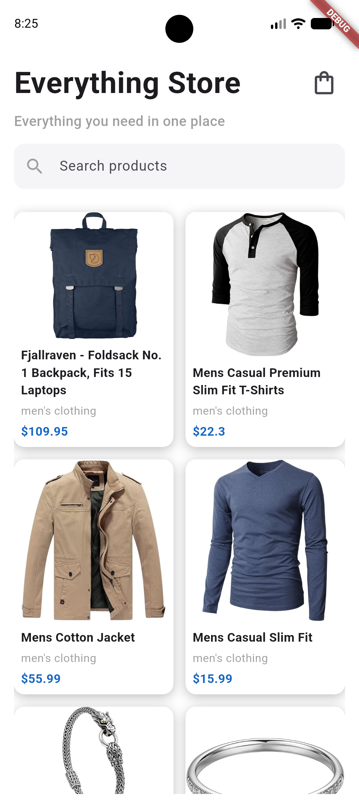
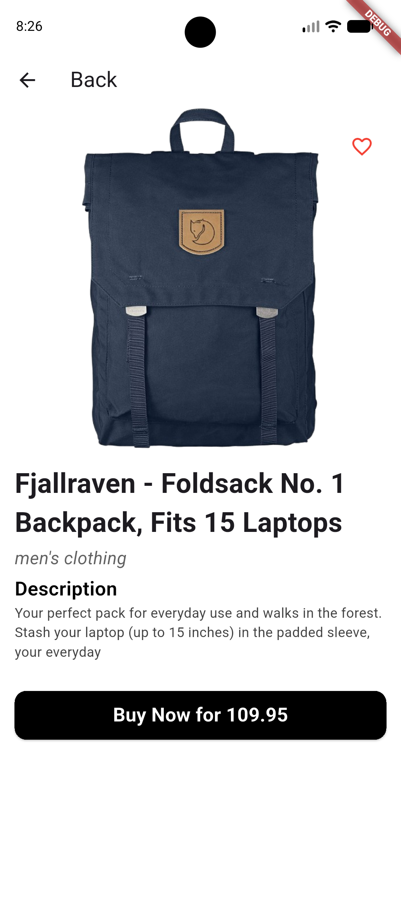
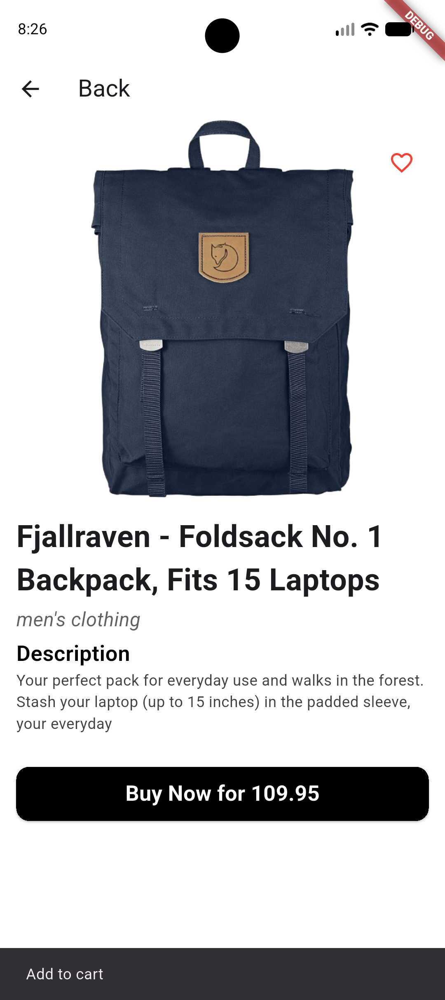
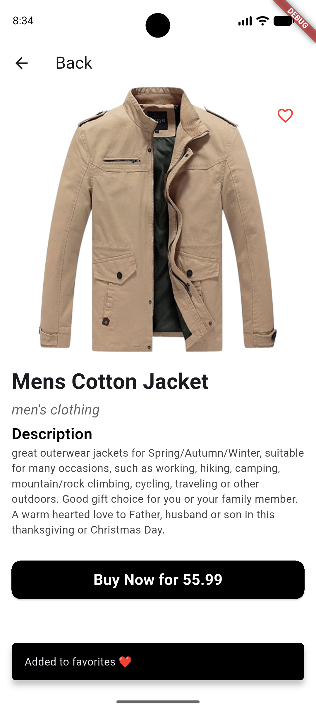
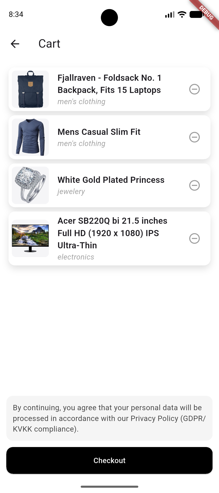

# Mobil App E-Commerce

## Proje Açıklaması
Bu proje, Flutter kullanılarak geliştirilmiş bir e-ticaret mobil uygulamasıdır. Kullanıcılar ürünleri listeleyebilir, ürün detaylarını görüntüleyebilir, ürünleri favorilere ekleyebilir, sepete ürün ekleyebilir ve sepette bulunan ürünleri silebilir. Temel alışveriş deneyimini simüle eden kullanıcı dostu bir arayüz sunmaktadır.

## Kullanılan Flutter Sürümü
Flutter SDK: 3.22.2  
Dart SDK: 3.4.3  

## Çalıştırma Adımları

### 1. Repository'i klonlayın

```bash
git clone https://github.com/buseeyldrm/Flutter-E-commerce.git
```

### 2. Proje klasörüne girin

```bash
cd Flutter-E-commerce
```

### 3. Gerekli paketleri yükleyin

```bash
flutter pub get
```

### 4. Uygulamayı çalıştırın

```bash
flutter run
```


## Ekran Görüntüleri






